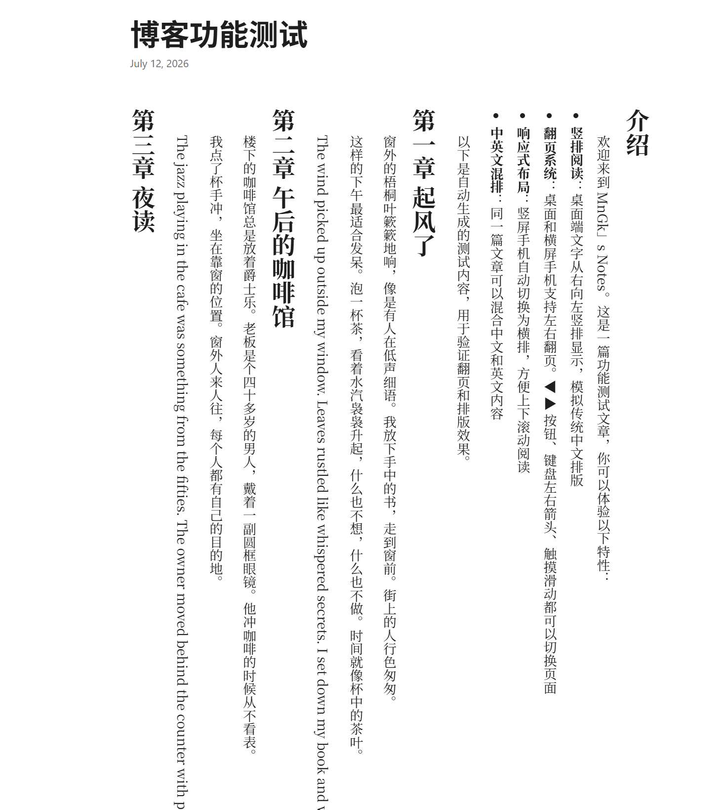

# Hugo Vertical Blog



PaperMod-based Hugo blog with **vertical Chinese writing (竖排)** and **page-flipping** navigation.

## Features

- Vertical text layout on desktop (writing-mode: vertical-rl)
- Page-flipping: long articles split into pages. Navigate via buttons, keyboard arrows, or touch swipe
- Portrait phones auto-switch to horizontal layout
- Works with existing PaperMod sites — just drop in the layouts

## Quick Start

```bash
hugo new site myblog && cd myblog
git init
git submodule add https://github.com/adityatelange/hugo-PaperMod themes/PaperMod
cp -r layouts/* myblog/layouts/
echo 'theme = "PaperMod"' >> hugo.toml
hugo server -D
```

## License

MIT
